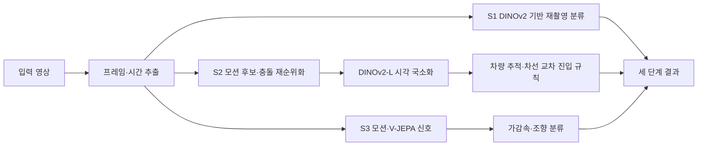

# Dashcam Accident Understanding · DACON 236753

**English abstract.** A three-stage black-box dashcam system for recapture detection, accident timing and driver-action classification. Our best public leaderboard score was **0.687403 (31st)**. The most useful gain came from a geometric lane-crossing rule for accident entry, tested with controlled submissions under a 60-minute inference limit.

## 과제와 결과

영상에서 (1) 원본/재촬영, (2) 충돌 시점·진입 시점·진입 방향·회피 공간, (3) 가감속·조향을 예측했다. 전체 점수는 `0.2 × S1 + 0.4 × S2 + 0.4 × S3`이다. S1은 두 클래스 F1 평균, S2는 충돌·진입 시점 정확도(각 ±0.3초, 각 35%)와 방향·회피 macro-F1(각 15%), S3는 가감속 macro-F1(70%)과 조향 macro-F1(30%)이다. [평가 구현](src/videohackathon/evaluation.py)은 공개된 형식의 로컬 재현 코드이며, 공식 점수는 [제출 기록](docs/experiments.md)에서 가져왔다.

| 최종 제출 | S1 | S2 | S3 | 전체 | 공개 순위 | 서버 실행 |
|---|---:|---:|---:|---:|---:|---:|
| S182_full | 0.878403 | 0.568529 | 0.710778 | **0.687403** | **31위** | 41분 35초 |

15위 컷은 최종 약 **0.76506**이었다. 9월 27일 아침의 0.63278(약 43위)에서 0.05462 올렸지만 목표했던 15위에는 못 미쳤다. 공개 리더보드 기준이며 비공개 최종 평가 성적을 주장하지 않는다.

## 핵심 설계와 실험

- **정의에 맞춘 진입 시점:** 충돌 차량의 궤적이 자차 주행 통로를 가로지르는 첫 시점을 찾는 S161 규칙이 S170 대비 숨은 평가 영상에서 **18개 진입 적중**을 더했다. S174는 9개를 더했고, S178/S180/S181 조합은 약 13.5개 적중 상당의 S2 개선을 냈다. S176은 약 1.9개 상당을 추가했다.
- **충돌 국소화:** 긴 영상에서 모션 후보를 재순위화하고 S172의 밀집 시각 특징을 합쳤다. S172 단독 추가는 S171 대비 **6개 충돌 적중**을 더했다. 로컬 Nexar OOF 개선은 공식 평가에 작게 옮겨졌으므로 로컬 수치만으로 채택하지 않았다.
- **실패에서 배운 점:** S145의 첫 프레임 진입 규칙은 진입 적중 24개를 잃었다. S148 가속 잔차 보정은 로컬 교차 검증 향상에도 공식 S3를 0.0865 낮췄다. 카메라·차량 도메인 차이를 과소평가했다.
- **실험 통제:** 한 업로드마다 단계별로 한 가지 변경만 넣어 기여도를 분리했다. 무거운 단계에는 시간 예산과 안전한 폴백을 두어 60분 제한을 지켰다. [시간순 기록](docs/journey.md)과 [전체 공식 제출표](docs/experiments.md)에 근거를 남겼다.

실험은 Codex와 Claude AI 코딩 에이전트를 오케스트레이션해 수행했다. 연구 방향, 가설, 채택과 중단 결정은 내가 내렸고, 에이전트가 구현과 실험 실행을 맡았다.

## 저장소 구성

| 경로 | 내용 |
|---|---|
| `src/final_pipeline/` | S182 제출물에서 추출한 추론 코드와 작은 설정 파일. 학습 가중치는 제외 |
| `src/videohackathon/` | 점수 계산 코드 |
| `experiments/` | 마지막 충돌·진입 개선안의 코드, 패치, 작업 보고서 |
| `configs/` | S182 단계별 설정 위치와 선택 동작 안내 |
| `docs/journey.md` | 날짜별 가설→실험→공식 결과→결정 |
| `docs/experiments.md` | 제출 장부의 모든 공식 시도 |
| `docs/data-and-licenses.md` | 데이터·사전학습 모델의 출처와 취득 방법 |
| `tools/` | 제출물 검증 및 출처 추출 도구 |

## 재현 범위

Python 3.11, Linux/CUDA 환경을 권장한다. 원래 제출 환경은 Python 3.11, PyTorch 2.8, TorchVision 0.23, OpenCV 4.10 등이었다. `pip install -r requirements.txt` 후 `python -m compileall -q src experiments tools`로 코드 구문을 확인할 수 있다. `PYTHONPATH=src python -m pytest tests/test_evaluation.py`는 데이터 없는 점수 계산 시험이다.

실제 예측을 재생하려면 [데이터 안내](docs/data-and-licenses.md)의 원본과 각 사전학습·학습 가중치를 별도로 취득하고, `src/final_pipeline/model/`의 제출 당시 상대 경로에 배치해야 한다. `src/final_pipeline/inference.py`는 원래 제출물의 진입점이다. 이 저장소에는 모델 가중치와 테스트 예측 결과가 없으므로 **체크아웃만으로 S182 전체 점수를 재현할 수 없다**. 학습 전체를 단일 명령으로 재생하는 매니페스트도 완성되지 않았다. 남은 재현 간극은 [교훈](docs/lessons.md)에 명시했다.

가중치를 갖춘 환경에서는 `src/final_pipeline`을 Python 경로에 추가하고 `inference.predict_stage1(data_dir, model_dir)`, `predict_stage2(...)`, `predict_stage3(...)`을 호출한다. `data_dir` 아래에는 해당 단계의 `images/` 폴더가, `model_dir`에는 `src/final_pipeline/model/` 경로가 들어간다. 반환값은 각 단계의 예측 DataFrame이다.

`experiments/`의 과거 실행 스크립트에서 로컬 절대 경로는 `$DATA_DIR`, `$USER_HOME`, `$GPU_REQUEST_PATH`로 치환했다. 과거 실험의 증거를 읽기 위한 보존본이며, 재실행 시 환경에 맞게 경로를 설정해야 한다.

## 출처와 권리

DACON 대회와 공개 베이스라인, Scoop, DLC-2021, comma2k19, Nexar, CCD 및 사전학습 모델 제작자에게 감사한다. 프로젝트 작성 코드는 [MIT](LICENSE)다. 외부 데이터와 가중치의 권리는 각 원저작자에게 있으며 **이 저장소에 포함되지 않는다**. 특히 Nexar와 CCD 영상은 재배포하지 않는다. 상세 조건과 링크는 [데이터·라이선스](docs/data-and-licenses.md)를 참조한다.
